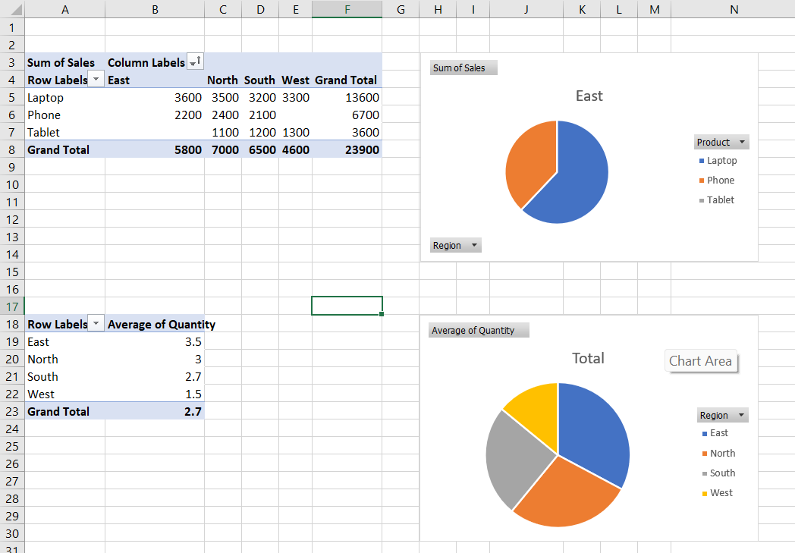

# 🧼 Excel Data Cleaning & Analysis

Welcome to my beginner data analysis project using **Microsoft Excel**. This is part of Week 1 of my Data Analyst learning journey.

---

## 📊 Project Overview

This mini project covers:
- Creating **pivot tables** to summarize data
- Exploring **sales trends by product and region**
- Using **basic Excel functions** like `SUM`, `AVERAGE`, `VLOOKUP`, `COUNTIF`
- Building a small **dashboard** inside Excel

---

## 📁 File(s) Included

| File | Description |
|------|-------------|
| `Week1_Day1_PivotReport.xlsx` |  |

---

## 🧠 Skills Practiced
- Data cleaning
- Data summarization
- Pivot tables
- Conditional formatting
- Basic Excel formulas

---

## 🧑‍💻 Data Analyst Journey - Day 2: Oracle SQL Basics
Welcome to Day 2 of my Data Analyst learning journey. In this session, I worked on getting hands-on with Oracle SQL.

---

## 📊 Project Overview
Today, I focused on:
- Creating tables with data types in Oracle SQL
- Using the SELECT statement with WHERE, AND, OR, and NOT
- Sorting results with ORDER BY
- Updating records with the UPDATE statement
- Filtering data based on conditions such as salary and department

---

## 📁 Files Included
| File | Description |
|------|-------------|
| `employee_table.sql` |	 |
| `select_queries.sql` |	SQL queries to filter and sort data based on specific conditions.(follow the link) |
| `update_queries.sql` |	SQL query to update an employee's data.(follow the link) |

---
## 🧠 Skills Practiced
Data querying with SELECT
- Filtering and sorting data with WHERE and ORDER BY
- Updating records using the UPDATE statement
- Data manipulation and logical operators like AND, OR, NOT

---

## 🚀 What's Next?
Next week I’ll move on to:
- Power BI / Tableau dashboards
- Python (Pandas) for data manipulation
- Real-world datasets & project uploads

Follow along! More updates coming as I build my Data Analyst portfolio 💼

---

## 🙋‍♂️ About Me

I'm currently learning data analysis step-by-step in my free time (1 hour/day + weekends).  
You can check out my full roadmap [here](#) (will be updated after ive done my own website)

